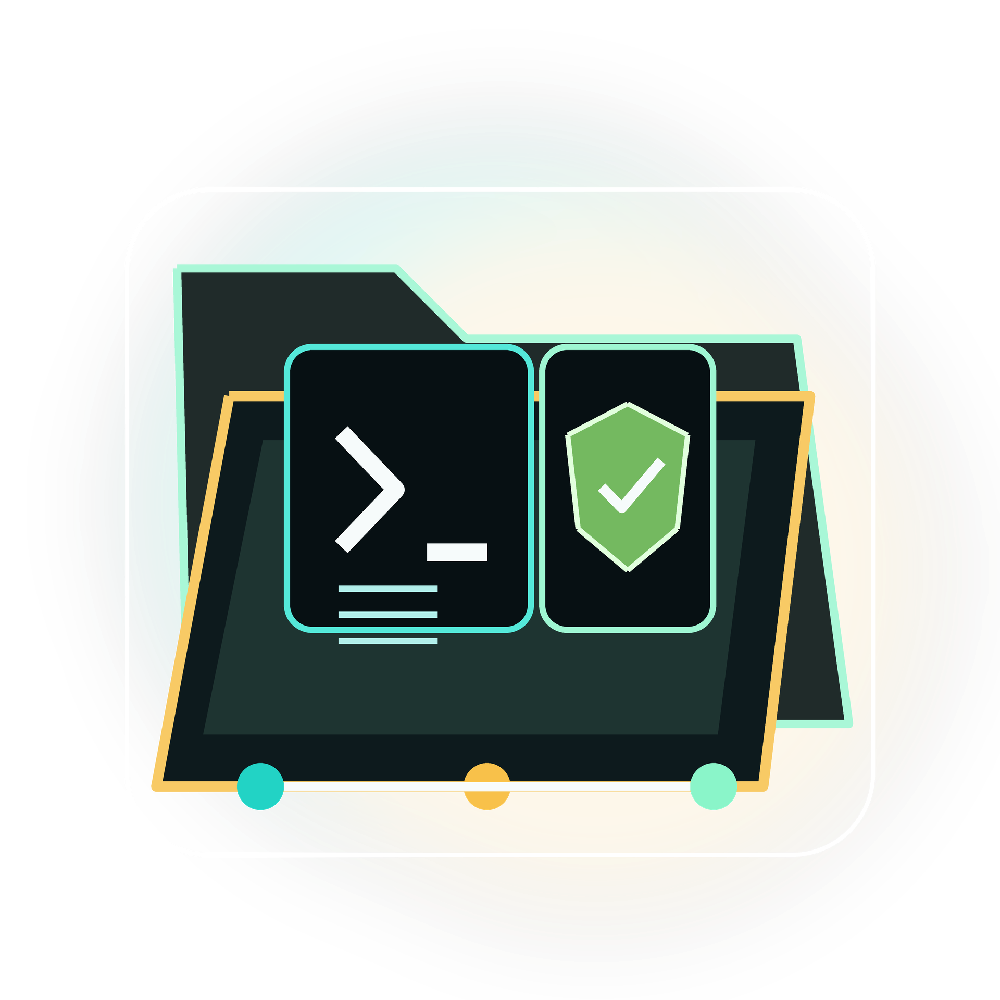

# Localsetup v3

<p align="center">
  
</p>

<p align="center">
  <a href="LICENSE"></a>
  <a href="https://agentskills.io/specification"></a>
  <a href="_localsetup/docs/PLATFORM_REGISTRY.md"></a>
</p>

**Version:** 3.0.0<br>
**Last updated:** 2026-05-07

Agentic setups often share the same headaches: indeterministic outcomes, memory that compresses or decays, hallucinations, agents that drop context or ignore instructions, and difficulty scaling beyond a certain code size. Coordinating multiple agents so they follow patterns and run workflows reliably is harder still. Localsetup v3 targets these problems without adding much overhead.

The framework source is repo-local: context, skills, docs, and v3 install manifests live under `_localsetup/`. V3 installs a managed shared skill library in your home directory and attaches repo adapter paths such as `.codex/skills` or `.kilo/skills` to that library. Context is code, so you can audit what changed and tie specs and outcomes to git commits. It installs with one command and works across Cursor, Claude Code, OpenAI Codex CLI, OpenClaw, Kilo, and OpenCode. Safety and sandboxing are built in; when you import third-party skills, the framework runs security checks and heuristics before anything touches your agent. Tooling can be refactored or rewritten in Python and standardized even when sources disagree, and you can adapt it to your stack.

Out of the box you get [all shipped skills](_localsetup/docs/SKILLS.md): debugging, TDD, PR review, git recovery, Linux patching, Ansible, and more. Skills follow the [Agent Skills](https://agentskills.io/specification) spec, so you can import from other ecosystems (e.g. Anthropic's public repo) and export yours. Version and docs are maintained in a separate maintainer workflow; see [_localsetup/docs/VERSIONING.md](_localsetup/docs/VERSIONING.md). Run one install command, verify with one script, then use the workflows. The result is a single, auditable agent setup that stays accurate over time.

## 📊 Current snapshot

<!-- facts-block:start -->
| Fact | Value |
|---|---|
| Current version | `3.0.0` |
| Supported platforms | `cursor, claude-code, codex, openclaw, kilo, opencode` |
| Shipped skills | `49` |
| Source | `_localsetup/docs/_generated/facts.json` |
<!-- facts-block:end -->

## 🚀 60-second quickstart

Run from your project root in Linux, macOS, or WSL2. V3 install is explicit and non-interactive.

### Linux and macOS (Bash)

```bash
curl -sSL https://raw.githubusercontent.com/cptnfren/localsetup/main/install | bash
```

```bash
./install --directory . --yes
```

By default, v3 installs every platform listed in `_localsetup/config/platforms.yaml`. Use `--tools codex,kilo` or `--platforms codex kilo` to limit adapter creation.

### Windows

Localsetup v3 supports Windows through WSL2 only. Run `wsl`, change to the repo path, and run `./install --directory . --yes`. `install.ps1` is a compatibility stub that prints WSL2 guidance and exits.

For one-liners and platform-specific examples, see [_localsetup/docs/QUICKSTART.md](_localsetup/docs/QUICKSTART.md).

## Shared home library

V3 installs managed skills to `~/.local/share/agents/skills/localsetup` and writes `localsetup.lock.json` in the repo. Roll back with `python3 _localsetup/tools/localsetup_v3.py rollback`.

### Minimum requirements

- **Required:** `python >= 3.10`.
- **Recommended:** `git >= 2.20.0`, `rg` (ripgrep), `pip`, and the packages in `_localsetup/requirements.txt`. Use `./install --directory . --yes --install-deps` to create/update the managed `.localsetup/venv`; do not use `--break-system-packages`.

Run `python3 _localsetup/tools/localsetup_v3.py doctor` for a read-only preflight, `configure` to normalize install intent, and `context --markdown` for an agent-readable install plan. Full list: [_localsetup/docs/MULTI_PLATFORM_INSTALL.md](_localsetup/docs/MULTI_PLATFORM_INSTALL.md#dependency-preflight).

## ⚡ Top 10 features

1. **Secure skill import with safety checks** - import any external skill or freeform text, run automatic prompt-injection detection, foreign-language screening, and heuristic security analysis before it touches your agent. Use the framework as a sandbox to build and adapt workflows however you see fit.
2. **Repo-local engine** - the entire framework lives at `_localsetup/`; clone or move your repo and everything travels together. No home-directory state, no cloud sync, no hidden drift.
3. **Multi-platform install** - one command installs adapters for Cursor, Claude Code, Codex CLI, OpenClaw, Kilo, and OpenCode. Add platforms later by editing `_localsetup/config/platforms.yaml`.
4. **Agent Skills spec compatible** - skills follow the open Agent Skills specification, so you can import from Anthropic's public repo, awesome lists, or your own library and export yours for others.
5. **Shipped skills** - debugging, TDD, PR review, git recovery, Linux patching, Ansible orchestration, codebase navigation (agentlens), tmux ops (pick/probe/send), system-info, cron-orchestrator, PRD batching, decision trees, and more, ready to use out of the box. See [_localsetup/docs/SKILLS.md](_localsetup/docs/SKILLS.md) for the full catalog.
6. **Workflow registry and quick-ref** - named workflow IDs, human-readable names, and aliases in [_localsetup/docs/WORKFLOW_REGISTRY.md](_localsetup/docs/WORKFLOW_REGISTRY.md), plus an agent-facing quick reference and composite pipelines (PR feedback loop, git repair and hygiene, server triage and patch, repo polish) in [_localsetup/docs/WORKFLOW_QUICK_REF.md](_localsetup/docs/WORKFLOW_QUICK_REF.md). Agents can invoke multi-step workflows by intent instead of chaining skills manually.
7. **Human-in-the-loop gates and Always-On-TMUX** - tmux shared sessions via tmux_ops (pick, probe, send with 1 s delay), sudo discovery and approval flow before destructive ops, and a tmux-default terminal mode that can run as an \"always-on tmux\" layer for this repo or machine. The agent pauses and waits for you when it matters.
8. **Versioning** - VERSION at repo root; conventional commits; version and docs are maintained in a separate maintainer workflow (see [_localsetup/docs/VERSIONING.md](_localsetup/docs/VERSIONING.md)).
9. **Skill metadata patching** - staged `SKILL.md` files get their `metadata.version` incremented automatically so skill docs stay accurate.
10. **Platform manifests and git-coupled traceability** - `_localsetup/config/platforms.yaml` defines supported adapter paths, and PRDs/specs/outcomes can reference commit hashes for audit. Context is code; changes are reviewable.

The full feature catalog contains additional capabilities. See [_localsetup/docs/FEATURES.md](_localsetup/docs/FEATURES.md) for details.

## 🛠️ Top 10 shipped skills

1. `ls-debug-pro` - systematic debugging methodology with language-specific commands.
2. `ls-test-runner` - write and run tests across frameworks (pytest, Jest, Vitest, Playwright).
3. `ls-pr-reviewer` - automated PR review with diff analysis, lint, and structured reports.
4. `ls-unfuck-my-git-state` - staged recovery for broken HEAD, phantom worktrees, missing refs.
5. `ls-linux-patcher` - automated server patching and Docker container updates.
6. `ls-ansible-skill` - playbook-driven provisioning and multi-host orchestration.
7. `ls-decision-tree-workflow` - reverse-prompt process: one question at a time, four options, rationale.
8. `ls-tmux-shared-session-workflow` - human-in-the-loop ops via tmux_ops (pick/probe/send); REMOTE_TMUX_HOST for remote/VMs.
9. `ls-skill-importer` - import external skills from URL or local path with security screening.
10. `ls-humanizer` - remove AI-writing patterns from text based on Wikipedia cleanup guide.

The generated shipped skills catalog lists all skills with descriptions and versions. See [_localsetup/docs/SKILLS.md](_localsetup/docs/SKILLS.md).

## 📚 Read more

- [Framework docs index](_localsetup/docs/README.md)
- [Framework README](_localsetup/README.md)
- [Platform registry](_localsetup/docs/PLATFORM_REGISTRY.md)
- [Workflow registry](_localsetup/docs/WORKFLOW_REGISTRY.md)
- [Skill importing](_localsetup/docs/SKILL_IMPORTING.md)
- [Skill discovery](_localsetup/docs/SKILL_DISCOVERY.md)
- [Contributing](CONTRIBUTING.md)
- [Security](SECURITY.md)

<details>
<summary>Full install reference</summary>

### Installer

```bash
./install --directory . --yes
```

Windows support is WSL2-only in Localsetup v3. Run `./install` inside WSL; `install.ps1` prints WSL2 guidance and exits.

### Non-interactive tool IDs

- `cursor`
- `claude-code`
- `codex`
- `openclaw`
- `kilo`

### Shared home library

```bash
./install --directory . --yes
```

### Examples

```bash
./install --directory . --tools cursor,claude-code --yes
```

### Update behavior

Re-run install with the same platform selection. The v3 installer refreshes the managed shared skill library, adapter links or portable copies, and `localsetup.lock.json`.

Example:

```bash
./install --directory . --tools cursor --yes
```

</details>

## 📜 License

Localsetup is released under the [MIT License](LICENSE).

---

<p align="center">
<strong>Author:</strong> <a href="https://github.com/cptnfren">Slavic Kozyuk</a><br>
<strong>Copyright</strong> © 2026 <a href="https://www.cruxexperts.com/">Crux Experts LLC</a> – Innovate, Automate, Dominate.
</p>
