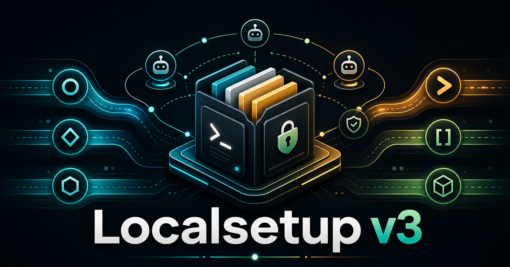
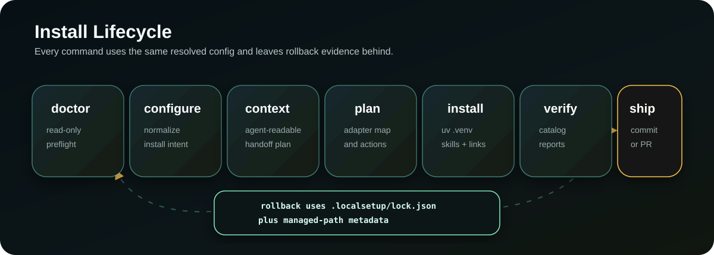

# Localsetup v3

<p align="center">
  
</p>

<p align="center">
  <a href="LICENSE"></a>
  <a href="https://agentskills.io/specification"></a>
  <a href="_localsetup/docs/PLATFORM_REGISTRY.md"></a>
</p>

**Version:** 3.7.2<br>

**Localsetup v3 gives coding agents a repo-local operating layer.**

Agent work is moving from one-off prompts into repeatable development operations. The hard part is not only giving an agent more context; it is keeping that context durable, reviewable, portable across tools, and safe enough for real repositories.

Localsetup v3 turns your repository into the source of truth for agent instructions, skills, workflow packages, adapter configuration, safety gates, install state, documentation truth, and release evidence. It is not another chat prompt collection. It is a portable framework with adapters for Cursor, Claude Code, OpenAI Codex CLI, OpenClaw, Kilo, and OpenCode, plus a disciplined package library and predictable controller workflow model.

Use it when you want agents to stop improvising from hidden local setup and start working from auditable context that travels with the code.

## The short version

Localsetup v3 packages:

- Repo-local framework source under `_localsetup/`
- 52 shipped capability skills plus 22 first-class workflow packages for debugging, testing, PR review, infrastructure, docs, git recovery, skill import, security vetting, context indexing, TypeScript code quality, opt-in harness automation, and agent workflow control
- Cross-platform adapters for Cursor, Claude Code, OpenAI Codex CLI, OpenClaw, Kilo, and OpenCode
- Agent Skills-compatible `SKILL.md` packages that can be imported, normalized, vetted, installed, and reused
- Workflow packages under `_localsetup/workflows/` that stay executable as skills while carrying Localsetup `workflow.yaml` metadata for aliases, gates, dependencies, and generated registries
- Documentation alignment tooling that inventories source-owned docs, maps code truth, audits generated facts, and refreshes supported public/generated surfaces
- Context-index tooling for vector-first SQLite retrieval, freshness checks, agent preflight, MCP configuration support, and machine-readable worklists
- A Python-first installer with preflight, planning, verification, rollback metadata, and generated docs sync
- Opt-in harness automation for Codex heartbeat and repo-finalizer workflows, plus human-in-the-loop operations for risky commands, remote/server work, and sudo-aware tmux sessions

That means your agent setup travels with the repo, survives context resets, and can be reviewed like code.

## How it fits together

<p align="center">
  
</p>

`_localsetup/` is the canonical source. The installer resolves configuration, creates the managed home library for skills and workflow packages, attaches only explicitly selected platform adapter paths, writes lock/report metadata, and records an install journal under `.localsetup/install-journal/`. Generated adapter trees are install output, not framework source.

## Skills and workflow packages

Localsetup v3 makes one important distinction explicit:

| Package type | Source root | Runtime shape | Use it for |
|---|---|---|---|
| Capability skill | `_localsetup/skills/ls-*` | Agent Skills `SKILL.md` package | A reusable capability such as debugging, testing, skill import, PR review, service triage, or versioning. |
| Workflow package | `_localsetup/workflows/ls-workflow-*` | Agent Skills `SKILL.md` package plus `workflow.yaml` | A named orchestration flow with aliases, required skills, gates, phases, validation, and expected outputs. |

Both package types install into `~/.local/share/agents/skills/localsetup`, so agent hosts can invoke them through explicitly attached adapter paths. The split keeps portable skills clean while making workflow orchestration auditable and generated from source manifests.

Start with the [workflow packages guide](_localsetup/docs/WORKFLOW_PACKAGES.md) for usage and the [workflow standard](_localsetup/docs/WORKFLOW_STANDARD.md) for authoring rules.

## Current snapshot

<!-- facts-block:start -->
| Fact | Value |
|---|---|
| Current version | `3.7.2` |
| Supported platforms | `cursor, claude-code, codex, openclaw, kilo, opencode` |
| Shipped skills | `52` |
| Workflow packages | `22` |
| Source | `_localsetup/docs/_generated/facts.json` |
<!-- facts-block:end -->

## 60-second quickstart

Global bootstrap from any directory on Linux, macOS, or WSL2:

```bash
curl -sSL https://raw.githubusercontent.com/CruxExperts/localsetup/main/install | bash -s --
```

This opens an interactive terminal wizard. It creates or refreshes the managed source checkout, explains what will be changed, lets you choose whether to attach agent adapters, and asks for confirmation before applying.

Every wizard step shows the same shortcuts before you answer: `Enter number(s) | d details | b back | q quit | ? help`. Detailed mode is on by default, so menu rows explain what each choice does, when to choose it, and the tradeoff. Press `d` at any prompt for compact mode; compact mode still keeps the one-line summary for each option.

The wizard stays dependency-free and line-oriented. It uses semantic color and simple status glyphs only when the terminal supports them; `NO_COLOR`, `TERM=dumb`, non-TTY output, `--no-color`, and `--color never` keep output free of ANSI color. Use `--color always` or `--glyphs unicode` only for an interactive terminal where you explicitly want that rendering; `--glyphs ascii` keeps portable labels such as `[OK]`, `[WARN]`, and `[FAIL]`.

The legacy public form still opens the same wizard when a terminal is available:

```bash
curl -sSL https://raw.githubusercontent.com/CruxExperts/localsetup/main/install | bash -s -- --yes --tools codex
```

Raw `main` bootstrap is the current development channel. For release verification, download the GitHub release tarball with its `.sha256` sidecar and run:

```bash
python3 _localsetup/tools/localsetup_v3.py --repo . verify-release dist/localsetup-v$(cat VERSION).tar.gz
```

Selecting tools in the wizard, or passing `--tools` / `--platforms`, attaches adapters such as `.codex/skills` to the chosen target. If you do not select tools, the install is global-library-only.

For automation, opt in explicitly:

```bash
curl -sSL https://raw.githubusercontent.com/CruxExperts/localsetup/main/install | bash -s -- --non-interactive --yes
```

Automation mode preserves machine-readable output. Without a terminal, the installer asks you to rerun with a TTY or with `--non-interactive --yes`.

From a cloned checkout, open the same wizard:

```bash
./install --directory .
```

The local checkout command uses that checkout as the registered source. Like the raw global bootstrap, it installs the managed skill library and creates no repo adapter paths unless you pass `--tools` or `--platforms`. Both paths also create a managed user command at `~/.local/bin/localsetup`. After registration, run Localsetup from any project:

```bash
localsetup install --tools codex --yes
```

When invoked through the managed command, Localsetup uses the registered framework checkout as the source and the nearest Git worktree root from your current directory as the target. Outside Git, it targets the current directory. Use `--target-directory /path/to/project` to override that target.

Attach adapters only for the hosts you choose:

```bash
localsetup install --tools codex,kilo --yes
```

Install every shipped skill and workflow package for Codex, Kilo, and OpenCode, while preparing the managed Python dependency environment:

```bash
./install --directory . --tools codex,kilo,opencode --packs bootstrap,core,dev,ops,integrations,publishing,harness,experimental --install-deps
```

Attach a selected adapter to another repo while using this checkout as the source:

```bash
./install --directory /path/to/localsetup --target-directory /path/to/project --tools cursor
```

To convert a repo that may contain old Localsetup files or adapter paths, start with a dry report and apply only after blockers are clear:

```bash
localsetup convert --tools codex --packs core
localsetup convert --tools codex --packs core --yes
```

Conversion writes a timestamped backup and machine-readable report under `.localsetup/backups/conversion-*`, archives known managed or legacy Localsetup artifacts, blocks ambiguous unmanaged content, syncs the current framework source when needed, installs selected adapters, and verifies the result.

Windows support is WSL2-only in v3. Open WSL2, change to the repo path, and run the Bash installer. `install.ps1` is a compatibility guidance stub.

Full install docs: [_localsetup/docs/QUICKSTART.md](_localsetup/docs/QUICKSTART.md) and [_localsetup/docs/MULTI_PLATFORM_INSTALL.md](_localsetup/docs/MULTI_PLATFORM_INSTALL.md).

Opt-in harness automation is documented separately because normal installs never schedule autonomous work. See [_localsetup/docs/HARNESS_AUTOMATION.md](_localsetup/docs/HARNESS_AUTOMATION.md) for `localsetup harness codex-heartbeat plan/init/enable/status/run/disable`.

## 10 reasons to use Localsetup v3

1. **Your agent context becomes code.** Instructions, skills, workflows, platform manifests, and docs live in the repo, so changes are visible in git instead of hidden in a local profile or a forgotten prompt.
2. **One skill library reaches multiple agent hosts.** When selected with `--tools` or `--platforms`, the shipped adapters let Cursor, Claude Code, OpenAI Codex CLI, OpenClaw, Kilo, and OpenCode attach to the same managed Localsetup skill library.
3. **It leans into portable skill packaging.** Skills use spec-compatible `SKILL.md` frontmatter, which makes them easier to import, export, normalize, and share across ecosystems that understand the package shape.
4. **It tackles the trust gap directly.** The framework pushes agents toward repeatable workflows, explicit verification, documented assumptions, and human gates instead of one-off "looks good" responses.
5. **It treats skill imports as supply-chain events.** External skills are discovered, validated, security-screened, summarized, and normalized before they become part of your library.
6. **It helps with the work developers actually hand agents.** Debugging, tests, PR review, codebase navigation, docs cleanup, git recovery, MCP building, Linux service triage, patching, and release chores are covered out of the box.
7. **It has safety rails for real machines.** Server and operations workflows route through tmux, sudo probing, backup/safety guidance, and explicit approval points for risky actions.
8. **It gives long-running work a shape.** First-class workflow packages, decision trees, PRD queues, Agent Q handoffs, generated registries, and outcome templates make multi-step agent work easier to restart, audit, and delegate.
9. **It makes installs reversible.** The v3 installer plans, applies, verifies, writes lock/registry metadata, supports adapter detach, and can roll back managed paths without treating generated adapter output as source.
10. **It keeps releases tidy.** Version sync, generated facts, strict manifest schemas, checksum/SBOM sidecars, framework audit, and Conventional Commit release tooling reduce the drift that makes public repos feel abandoned.

## Shipped packages worth starting with

These are not toy prompts. They are practical skills and workflows from the shipped library.

| Package | Why it matters |
|---|---|
| `ls-agentlens` | Helps agents explore larger codebases through structured navigation instead of blind file-hopping. |
| `ls-debug-pro` | Gives debugging a repeatable method across Node, Python, Swift, network issues, and git bisect. |
| `ls-test-runner` | Guides test creation and execution across pytest, Jest, Vitest, Playwright, and XCTest. |
| `ls-typescript-code-quality` | Guides TypeScript, TSX, tsconfig, typed linting, Node TypeScript scripts, and framework-heavy TypeScript changes. |
| `ls-pr-reviewer` | Turns PR review into a structured risk hunt: diff analysis, security concerns, test gaps, and style issues. |
| `ls-documentation-alignment` | Audits docs against implementation truth, generated facts, assets, and source-owned documentation surfaces. |
| `ls-github-publishing-workflow` | Packages public GitHub readiness checks around docs, versioning, security policy, release evidence, and repository settings. |
| `ls-mcp-builder` | Helps build high-quality MCP servers for current agent/tool interoperability workflows. |
| `ls-skill-importer` | Imports skills from URLs or local paths with discovery, validation, security screening, and summaries. |
| `ls-skill-vetter` | Reviews third-party skills as untrusted inputs before they join your agent environment. |
| `ls-codex-heartbeat` | Initializes and runs opt-in heartbeat checks with transaction-safe artifacts and explicit cron activation. |
| `ls-keepass-secrets` | Resolves logical secrets through KeePassXC with safe mapping files and redacted output defaults. |
| `ls-cloudflare-dns` | Manages Cloudflare DNS through deterministic JSON plans, snapshots, dry runs, and guarded apply flows. |
| `ls-workflow-ops-tmux-session` | Keeps human-controlled server operations visible, resumable, and sudo-aware. |

See the generated catalogs for all shipped skills and workflows: [_localsetup/docs/SKILLS.md](_localsetup/docs/SKILLS.md) and [_localsetup/docs/WORKFLOW_QUICK_REF.md](_localsetup/docs/WORKFLOW_QUICK_REF.md).

## Install lifecycle

<p align="center">
  
</p>

The Bash wrapper stays thin. The Python CLI handles preflight, dependency setup, adapter planning, managed skill installation, verification, generated docs, packaging, and rollback.

Useful commands:

```bash
localsetup doctor
localsetup verify --tools codex --level filesystem
localsetup diff --tools codex
localsetup skill search context
localsetup workflow info ls-workflow-audit-framework
localsetup why --packs core
localsetup graph
localsetup adopt --target-directory .
localsetup sbom --out /tmp/localsetup-source.cdx.json
python3 _localsetup/tools/localsetup_v3.py doctor
python3 _localsetup/tools/localsetup_v3.py --repo . context --markdown
python3 _localsetup/tools/localsetup_v3.py --repo . validate-catalog
python3 _localsetup/tools/localsetup_v3.py --repo . rollback
```

Use `--trace-json /path/to/events.jsonl` with `install`, `verify`, or `doctor` to append local JSONL trace events for automation review.

## What Localsetup is solving

Agent tooling moves quickly, but the hard parts stay stubbornly practical. Teams still need context that survives across sessions, standards that work across tools, safety around imported instructions, and workflows that can be resumed by another human or agent without archaeology.

Localsetup's opinion is simple: keep the agent operating model close to the code. Make it installable. Make it reviewable. Make it boring enough to trust.

The design follows a few durable pressures instead of chasing market snapshots:

- Agents need repo-owned context, not only session memory.
- Imported instructions and skills need supply-chain treatment before they are trusted.
- Tool and data access should be explicit, least-privilege, and reviewable.
- Long-running work needs checkpoints, validation evidence, and handoff notes.
- Interoperability work such as [Model Context Protocol](https://modelcontextprotocol.io/docs/getting-started/intro) and [Agent Skills](https://agentskills.io/specification) is useful, but Localsetup keeps those integrations source-owned and replaceable.

## Requirements

- Python `>= 3.10`
- Bash on Linux, macOS, or WSL2
- Git and network access to GitHub for raw bootstrap, unless installing from a local clone
- Recommended: `rg`, `pip`, and the packages in `_localsetup/requirements.txt`; managed installs prefer `_localsetup/requirements.lock` with pip hash checking when present.

Use managed dependency setup instead of system pip overrides:

```bash
./install --directory . --install-deps
```

## Read more

- [Framework docs index](_localsetup/docs/README.md)
- [Framework README](_localsetup/README.md)
- [Feature catalog](_localsetup/docs/FEATURES.md)
- [Platform registry](_localsetup/docs/PLATFORM_REGISTRY.md)
- [Harness automation](_localsetup/docs/HARNESS_AUTOMATION.md)
- [Workflow packages](_localsetup/docs/WORKFLOW_PACKAGES.md)
- [Workflow standard](_localsetup/docs/WORKFLOW_STANDARD.md)
- [Workflow registry](_localsetup/docs/WORKFLOW_REGISTRY.md)
- [Skill importing](_localsetup/docs/SKILL_IMPORTING.md)
- [Skill discovery](_localsetup/docs/SKILL_DISCOVERY.md)
- [Contributing](CONTRIBUTING.md)
- [Support](SUPPORT.md)
- [Code of conduct](CODE_OF_CONDUCT.md)
- [Security](SECURITY.md)

## License

Localsetup is released under the [MIT License](LICENSE).

## Community and Support

For bugs, use the bug report form and include the Localsetup version, platform ID, command, expected result, actual result, and validation output. For feature requests, use the feature form and name the affected skill, workflow package, platform, or docs area. For version-sync, generated-doc, publish, or package-artifact problems, use the maintenance form.

Use [GitHub Discussions](https://github.com/CruxExperts/localsetup/discussions) for usage questions and early design conversation. Report security-sensitive issues through private vulnerability reporting when available; otherwise open a minimal public issue asking for a secure contact without details.
