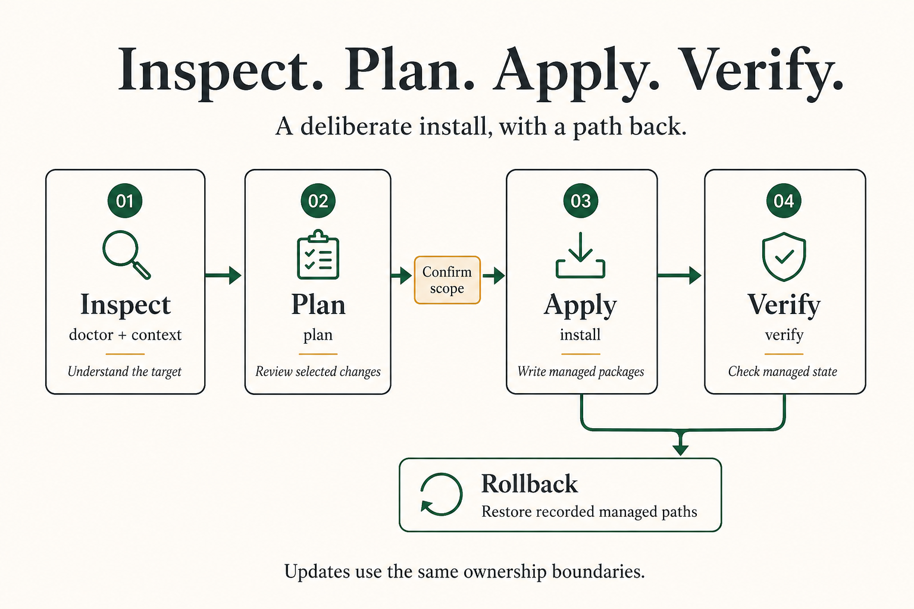

# LocalSetup Framework Engine

**Version:** 4.4.1<br>

`ls/` is the engine that makes the public LocalSetup promise real. It stores the framework code, shipped skills, workflow packages, platform templates, docs, tests, and install manifests that turn a repository into a portable agent workspace.

For the public product overview, start with the [root README](../README.md). This page is the contributor and maintainer map for the framework internals.

<p align="center">
  
</p>

## What this directory owns

- **Framework source:** Python tooling, shared libraries, templates, config manifests, tests, docs, shipped skills, and workflow packages.
- **Skill source of truth:** Every shipped capability skill lives under `skills/ls-*` as an Agent Skills-compatible `SKILL.md` package.
- **Workflow source of truth:** Every first-class workflow package lives under `workflows/ls-workflow-*` with `SKILL.md` plus LocalSetup `workflow.yaml` metadata.
- **Platform adapters:** Templates and manifests define how explicitly selected agent hosts attach to the managed LocalSetup package library.
- **Public docs:** `docs/` explains install behavior, platform support, workflow registries, skill import, Agent Q transport, versioning, and release validation.
- **Verification:** The LocalSetup CLI and framework audit tools validate catalog shape, generated docs, migration state, and release readiness.

LocalSetup-managed entries in consuming repositories are install output. Adapter directories may also contain project-owned skills, files, and symlinks; preserve that content in place. See [adapter ownership](docs/ADAPTER_OWNERSHIP.md).

The [4.4.0 release guide](docs/releases/4.4.0.md) explains the consolidated context, workflow routing, and package-content changes.

## Install flow

<p align="center">
  
</p>

The root Bash installer delegates to the Python CLI. The CLI resolves platform intent, creates or refreshes the managed home package library, attaches only explicitly selected repo adapter paths, writes lock/report metadata, and supports rollback for managed paths.

Common commands from the repository root:

```bash
./install --directory .
./install --directory . --tools codex,kilo
./install --directory /path/to/localsetup --target-directory /path/to/project --tools cursor
./install --directory . --tools codex --non-interactive --yes
uv run --locked python ls/tools/localsetup.py doctor
uv run --locked python ls/tools/localsetup.py --source-root . validate-catalog
uv run --locked python ls/tools/localsetup.py --source-root . rollback
```

The root wrapper opens the interactive wizard by default. Automation must use `--non-interactive --yes`.

Use WSL2 for Windows. Native PowerShell installation is intentionally not supported in the current framework.

`doctor repair` is the conservative repair path for legacy or partial target repos. It reports inferred platforms, adapter mode, repo skills, repo workflows, custom repo skills, and stale framework state without mutating by default. Safe repair can remove a legacy `ls/` only after backup and only when the target tree matches the current framework source contents exactly; tracked framework trees are untracked with `git rm --cached` before the working tree is removed. Custom, dirty, protected, symlinked, or content-divergent `ls/` trees are preserved for migration planning and can produce compact agent handoff prompts.

`.localsetup/lock.json` is managed repo state. Runtime summaries, install journals, backups, health state, and context-index runtime data are local runtime state and are excluded through `.git/info/exclude`.

## Directory map

| Path | Purpose |
|---|---|
| `config/` | Platform manifests, pack lists, and default framework configuration. |
| `discovery/` | OS discovery helpers and compatibility launchers. |
| `docs/` | Public framework docs shipped with the repo. |
| `lib/` | Shared shell and helper library code. |
| `skills/` | Source packages for all shipped `ls-*` skills. |
| `templates/` | Platform-specific context loaders and adapter templates. |
| `tests/` | Bash and pytest coverage for framework behavior. |
| `tools/` | LocalSetup CLI, docs generation, validation, release, skill index, and Agent Q tooling. |
| `core/` | Planner, apply, verify, rollback, versioning, and CLI implementation modules. |
| `workflows/` | Source packages for all shipped `ls-workflow-*` workflow packages. |

## Supported platforms

The canonical list lives in [docs/PLATFORM_REGISTRY.md](docs/PLATFORM_REGISTRY.md). Current platform IDs are:

- `cursor`
- `claude-code`
- `codex`
- `openclaw`
- `kilo`
- `opencode`

Omitting `--tools` or `--platforms` installs the managed library only. Use `--tools` or `--platforms` to attach the selected repo adapter paths.

## Skill model

Skills are task-focused instruction packages. LocalSetup keeps the canonical source under `ls/skills/` in the source checkout, installs managed copies to `~/.local/share/localsetup/packages`, and attaches selected platform adapter paths to that library by symlink or portable copy.

Useful docs:

- [Shipped skills catalog](docs/SKILLS.md)
- [Agent Skills compliance](docs/AGENT_SKILLS_COMPLIANCE.md)
- [Skill importing](docs/SKILL_IMPORTING.md)
- [Skill interoperability](docs/SKILL_INTEROPERABILITY.md)
- [Skill normalization](docs/SKILL_NORMALIZATION.md)

## Workflow package model

Workflow packages are executable orchestration packages. They live under `ls/workflows/ls-workflow-*`, include a valid Agent Skills `SKILL.md`, and add a LocalSetup `workflow.yaml` manifest. The manifest is the source for workflow IDs, aliases, required skills, gates, phases, validation, outputs, and generated registry rows.

The install planner selects workflows from `ls/config/pack.yaml`, installs them beside skills in the managed home library, and auto-includes required capability skills. Generated workflow docs should come from manifests, not hand-edited tables.

Useful docs:

- [Workflow packages guide](docs/WORKFLOW_PACKAGES.md)
- [Workflow package standard](docs/WORKFLOW_STANDARD.md)
- [Workflow registry](docs/WORKFLOW_REGISTRY.md)
- [Workflow quick reference](docs/WORKFLOW_QUICK_REF.md)

## Maintenance checks

Run these before release-oriented changes:

```bash
uv run --locked python ls/tools/generate_docs_artifacts.py --repo-root .
uv run --locked python ls/tools/localsetup.py --source-root . validate-catalog
uv run --locked python ls/tools/localsetup.py --source-root . validate-package-surface
uv run --locked python ls/tools/localsetup.py --source-root . scan-migration
uv run --locked python ls/skills/ls-framework-audit/scripts/run_framework_audit.py --output /tmp/ls-framework-audit.md
workers="$(uv run --locked python ls/tools/localsetup.py --source-root . test-workers)"
uv run --locked pytest -n "$workers" ls/tests -q
git diff --check
```

For ordinary edits, run focused tests and matching LocalSetup validators before this broad release-oriented set. Treat the full Python suite as final consolidation, not the first validation step. Resolve the permitted worker count with `localsetup test-workers`; [COMMAND_REFERENCE.md](docs/COMMAND_REFERENCE.md) owns its formula and aggregate-budget rule.

For the full version and release flow, see [docs/VERSIONING.md](docs/VERSIONING.md).

## Public docs

Start here:

- [Docs index](docs/README.md)
- [Quickstart](docs/QUICKSTART.md)
- [Command reference](docs/COMMAND_REFERENCE.md)
- [LSCli setup, coding, sessions and tool-free completion](docs/LSCLI.md)
- [SDK source and artifact ownership](docs/SDK_FORK.md)
- [Harness activation, typed LSCli and controller accounting](docs/HARNESS_AUTOMATION.md)
- [Features](docs/FEATURES.md)
- [Platform registry](docs/PLATFORM_REGISTRY.md)
- [Workflow registry](docs/WORKFLOW_REGISTRY.md)
- [Security policy](../SECURITY.md)
- [Contributing guide](../CONTRIBUTING.md)
