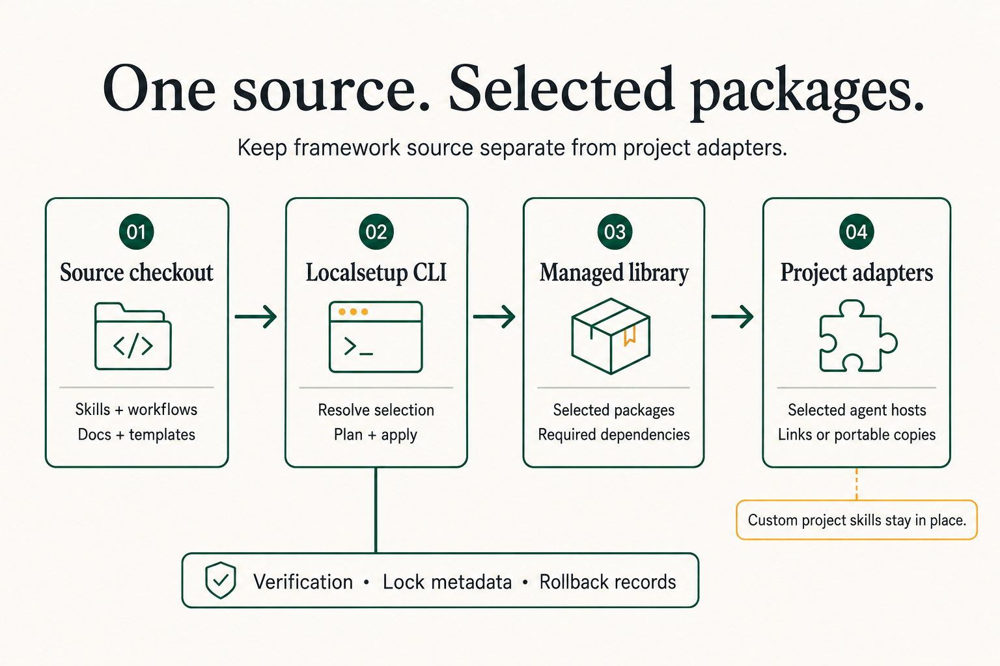

# Framework Docs Index

This is the public documentation map for LocalSetup. Start here when you want the install path, platform behavior, shipped skills, workflow model, or release/verification rules.

  

## Generated Facts

<!-- facts-block:start -->
- Current version: `4.22.3`
- Supported platforms: `codex, claude-code, cursor, kilo, opencode, openclaw, github-copilot-cli, github-copilot-vscode, cline-cli, cline-vscode, amp-cli, goose-cli, pi-cli, hermes-agent, qwen-code-cli, kimi-cli, factory-droid, antigravity-app, gemini-cli, omp-cli`
- Shipped skills: `103`
- Workflow packages: `16`
- Source: `ls/docs/_generated/facts.json`
<!-- facts-block:end -->

## Start Here

| Page | What it answers |
|---|---|
| [Project README](../../README.md) | Why LocalSetup exists and why people should use it. |
| [Quickstart](QUICKSTART.md) | How to install, select platforms, verify, and update. |
| [4.4.0 release guide](releases/4.4.0.md) | Context consolidation, workflow ownership, package cleanup, and update verification. |
| [Command reference](COMMAND_REFERENCE.md) | Copy-paste installer, managed CLI, validation, and maintainer commands. |
| [LSCli operations](LSCLI.md) | Explicit profiles, offline runtime/command setup, protected coding, sessions, recovery, branches, compaction and tool-free completion. |
| [LSCli runtime contracts](LSCLI_RUNTIME.md) | Grants, disclosure, sandbox resources, broker protocols, durable evidence and completion schemas. |
| [LSCli candidate qualification](LSCLI_QUALIFICATION.md) | Historical installed-artifact scenarios and their host/provider limits, separate from final published-release acceptance. |
| [SDK source ownership](SDK_FORK.md) | Private SDK payload, upstream provenance, dependency locks and artifact/SBOM verification. |
| [Client integration metadata](CLIENT_INTEGRATION_METADATA.md) | Distinguish lifecycle, installation guidance, catalog support, and qualification evidence. |
| [Deterministic client state](CLIENT_STATE.md) | Resolve client state, allocate private artifacts, and verify restart bindings. |
| [Features](FEATURES.md) | Full capability catalog grouped by practical use. |
| [Shipped skills catalog](SKILLS.md) | All shipped skills with IDs, versions, and descriptions. |
| [Bootstrap packs](bootstrap-packs/INDEX.md) | Reusable Codex-first bootstrap prompts, pack metadata, audit boundaries, and future adapter entry points. |
| [Workflow packages](WORKFLOW_PACKAGES.md) | How workflow packages differ from skills, install, validate, and generate docs. |
| [Workflow package standard](WORKFLOW_STANDARD.md) | Rules for first-class workflow packages and `workflow.yaml`. |
| [Platform registry](PLATFORM_REGISTRY.md) | Canonical platform IDs, paths, and adapter rules. |
| [Adapter ownership](ADAPTER_OWNERSHIP.md) | Shared adapter-directory ownership rules for install, repair, verify, detach, rollback, and migration planning. |
| [Product naming and branding](BRANDING.md) | Display names, preserved technical identifiers, exact exceptions, and visual review evidence. |
| [Multi-platform install](MULTI_PLATFORM_INSTALL.md) | Detailed install behavior and options. |
| [Harness automation](HARNESS_AUTOMATION.md) | Opt-in heartbeat activation, typed LSCli profiles, reserved actions/controller accounting, runtime artifacts, cron gating and command-policy boundaries. |

## Skills And Workflow Packages At A Glance

LocalSetup installs both capability skills and workflow packages into the managed package library. Keep [WORKFLOW_PACKAGES.md](WORKFLOW_PACKAGES.md) as the canonical reference for:

- source layout and runtime shape
- installer behavior and dependency pull-in
- validation and generated workflow docs

## Core Workflows

| Page | What it covers |
|---|---|
| [Workflow registry](WORKFLOW_REGISTRY.md) | Named workflows, aliases, impact expectations, and when to use them. |
| [Workflow quick reference](WORKFLOW_QUICK_REF.md) | Agent-facing workflow shortcuts and composite pipelines. |
| [Decision tree workflow](DECISION_TREE_WORKFLOW.md) | Reverse-prompt planning: one question, options, preferred choice, rationale. |
| [PRD schema and external agent guide](PRD_SCHEMA_EXTERNAL_AGENT_GUIDE.md) | Spec format, outcome template, and external-agent handoff fields. |
| [Git traceability](GIT_TRACEABILITY.md) | How PRDs, specs, outcomes, and commits stay connected. |
| [Tmux ops managed workflow](ops/tmux-ops-managed.md) | Human and agent guide for managed tmux sessions, sudo probe, run IDs, logs, status, and cancellation. |
| [Tmux ops remote guide](ops/tmux-ops-remote.md) | How to run human-visible ops when tmux is on another host. |

## Skills

| Page | What it covers |
|---|---|
| [Skills and rules](SKILLS_AND_RULES.md) | How always-loaded context, skills, and adapters fit together. |
| [Agent Skills compliance](AGENT_SKILLS_COMPLIANCE.md) | How LocalSetup implements the Agent Skills spec. |
| [Skill importing](SKILL_IMPORTING.md) | Import skills from URLs or local paths with validation and screening. |
| [Skill discovery](SKILL_DISCOVERY.md) | Public skill registry/index workflow and recommendations. |
| [Skill interoperability](SKILL_INTEROPERABILITY.md) | How skills move between LocalSetup and spec-compatible hosts. |
| [Skill normalization](SKILL_NORMALIZATION.md) | How imported or in-tree skills are cleaned up and standardized. |
| [Task skill matching](TASK_SKILL_MATCHING.md) | How agents choose the right skill for a task. |

Registered capability highlights:

- `ls-nodejs-nextjs`: Node.js/Next.js/React runbook for package-manager, build, migration, debugging, testing, security, deployment, and current-version verification.
- `ls-github-starredrepos`: GitHub starred repository archive workflow for authenticated context checks, dry-run sync, repo scouting, metadata snapshots, and guarded publish flows.
- `ls-shadcn-ui`: shadcn/ui component workflow for setup, components, CLI/MCP, registry, theming, forms, aliases, Radix/Base UI, updates, and troubleshooting.
- `ls-typescript-code-quality`: TypeScript/TSX code quality, tsconfig, typed ESLint or Biome config, Node TypeScript scripts, and TypeScript-heavy framework code.
- `ls-ui-browser-debugging`: UI review and browser-driven debugging workflow for Chrome DevTools MCP, Playwright MCP/CLI, browser ownership, evidence capture, minimal fixes, and durable UI regression tests.
- `ls-requesting-code-review`: Use when requesting code review before merge or after substantial changes; provide focused requirements, diff range, and severity-calibrated review instructions.
- `ls-omniroute-update`: OmniRoute update reporting for upstream skill discovery, LocalSetup comparison, provenance metadata, and report-first import/update/removal planning.

## Agent Q Transport

Agent Q is the bidirectional handoff layer for PRD/spec exchange over file_drop or mail with sealed payloads, registry checks, and ledgered outcomes.

| Page | What it covers |
|---|---|
| [Agent-to-agent protocol](AGENTIC_AGENT_TO_AGENT_PROTOCOL.md) | Transport principles, flows, pre-ship checks, and PRD field mapping. |
| [Agent Q scenarios](AGENTIC_AGENT_Q_SCENARIOS.md) | Same-machine, multi-repo, local/remote, mail, and file_drop scenarios. |
| [Agent Q build spec](AGENTIC_AGENT_Q_BIDIRECTIONAL_BUILD_SPEC.md) | Implementation order and backlog for the transport client. |
| [Agent Q pattern](AGENTIC_AGENT_Q_PATTERN.md) | Queue layout and PRD file movement model. |

## Maintenance And Release

| Page | What it covers |
|---|---|
| [Versioning](VERSIONING.md) | VERSION source of truth, Conventional Commits, and release sync. |
| [Documentation alignment summary](_generated/docs-alignment-summary.md) | Generated inventory, truth map, asset manifest, and docs-alignment audit results. |
| [Harness automation](HARNESS_AUTOMATION.md) | Explicit activation rules for autonomous harness capabilities. |
| [Repository maintenance](REPO_MAINTENANCE.md) | GitHub rulesets, required checks, labels, triage, security settings, and release-maintenance gates. |
| [Document lifecycle](DOCUMENT_LIFECYCLE_MANAGEMENT.md) | ACTIVE, DRAFT, PROPOSAL, and deprecation rules. |
| [Repo and data separation](REPO_AND_DATA_SEPARATION.md) | What belongs in source vs. local/generated state. |
| [Tooling policy](TOOLING_POLICY.md) | Python-first tooling expectations and public docs constraints. |
| [Python architecture standard](PYTHON_ARCHITECTURE_STANDARD.md) | Python architecture: new and substantially refactored Python tooling follows ls/docs/PYTHON_ARCHITECTURE_STANDARD.md; keep entrypoints thin, package responsibilities explicit, and existing debt baseline-managed. |

## Public Project Links

- [Contributing](../../CONTRIBUTING.md)
- [Security](../../SECURITY.md)
- [Support](../../SUPPORT.md)
- [Code of conduct](../../CODE_OF_CONDUCT.md)
- [License](../../LICENSE)
